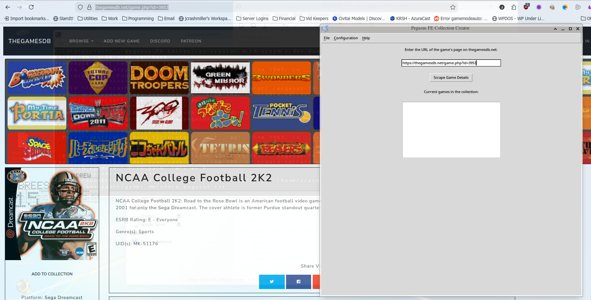
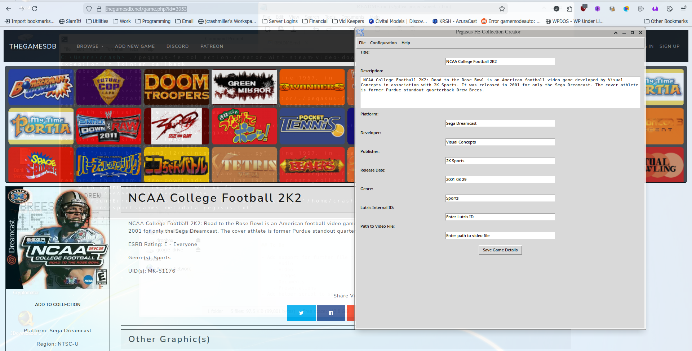
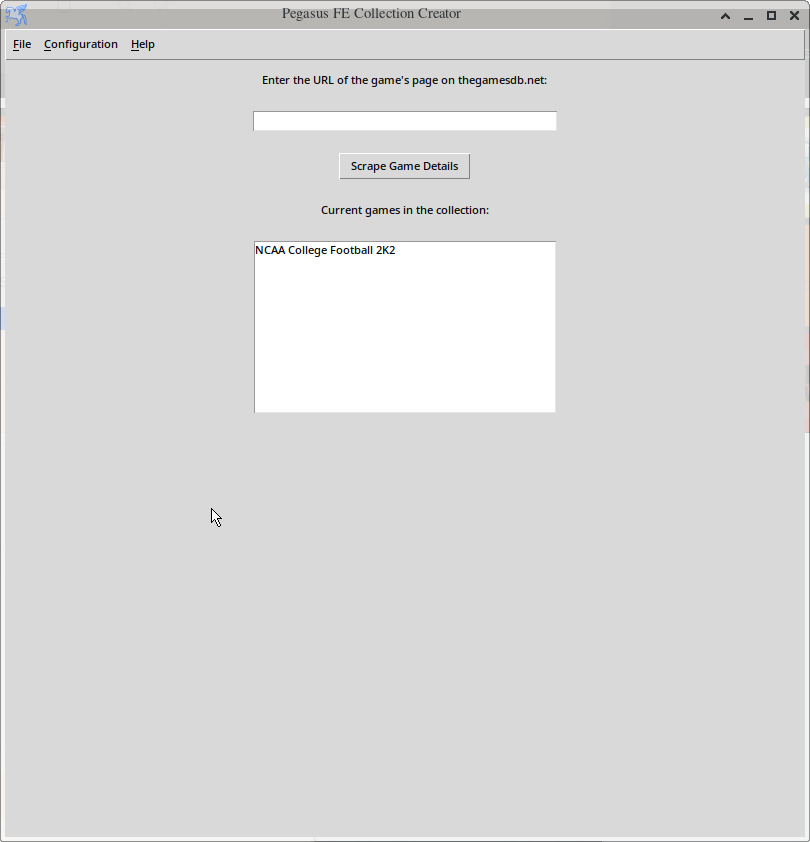
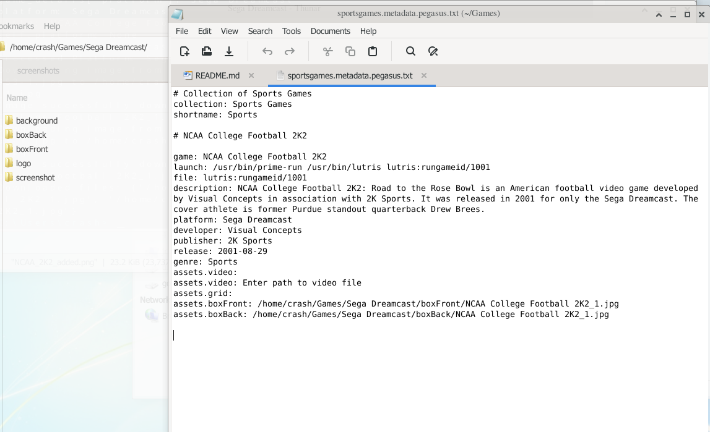

# game-shelf-curator

GUI with thegamesdb and steam scraper to easily add games to new or existing pegasys game launcher collections. Can be expanded to support other sites for scraping and other game launchers and front ends.

# Screenshots

# Features
- Scraping metadata and images from thegamesdb.net, store.steampowered.com
- Download screenshots and box art
   - Automatically add entries for downloaded images to metadata.txt
- Edit scraped metadata before committing
- Lutris game ID for launch command

# Considerations
- Scrapes thegamesdb.net and store.steampowered.com
    **Please do not overload their servers**

## Note
As the screenshots from thegamesdb.net and NCAA 2K2 are used for demonstration purposes, it is believed they are used within fair use doctrine.  All trademarks are the property of their respective owners.
